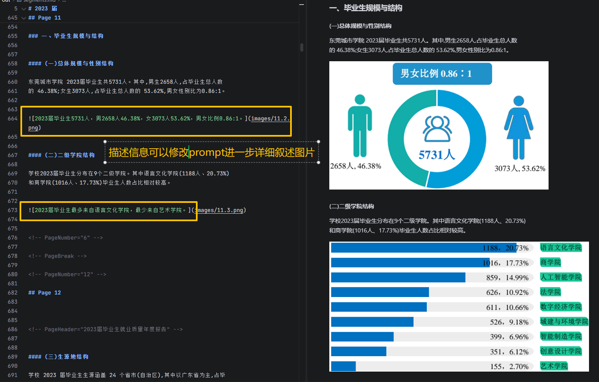

[中文](README_zh.md)

# RAG-Ready

**A command-line tool to convert local documents into Markdown and RAG data slices.**

`RAG-Ready` helps you turn various local documents into data suitable for AI retrieval. It supports multiple file formats and is specifically optimized for common issues in PDF parsing such as **broken tables across pages, missing image information, and messy layout**. By leveraging Azure AI capabilities, it extracts cleaner text, providing the cleanest data for your vector database.

---

## Key Features

* **Multi-format Support**: Directly handles `txt`, `md`, `json`, `html`, and `PDF` files.
* **PDF Optimization**:
* **Table Merging**: Automatically identifies and merges tables spanning across pages to maintain data integrity.
* **Image Captioning**: Automatically extracts images from PDFs and calls **Azure OpenAI** to generate text descriptions, facilitating future image content search.


* **Direct Slice Generation**: Automatically chunks documents while generating JSON data and Markdown preview files.
* **Easy to Use**: Operates via command line; one-click conversion after environment configuration.

---

## Process

1. **Input**: Read documents (PDF/Word/HTML, etc.).
2. **Parse**: Use Azure Document Intelligence to identify text and layout.
3. **Enhance**: Use Azure OpenAI to identify image content and write descriptions.
4. **Output**: Generate JSON slices for databases and Markdown documents for inspection.

---

## Examples (Test file source [https://dgcu.edu.cn/infoview/16435.html](https://dgcu.edu.cn/infoview/16435.html))

### 1. Image Extraction and Description

> Automatically locates images and generates descriptions using AI, appending to ``.



### 2. Cross-page Table Merging

> Automatically resolves table breakage issues caused by PDF pagination.


---

## Quick Start

### 1. Install Environment

Suggested Python 3.10 or higher.

```bash
# Install basic dependencies
pip install -r requirements.txt

# If PDF parsing is needed (Azure DI)
pip install -r requirements-azure-di.txt

# If AI image captioning is needed (Azure OpenAI)
pip install -r requirements-aoai.txt
```

### 2. Standard Run (Process Text/HTML/JSON)

```bash
python -m rag_ready --file "document_path.txt" --output-dir "./out"
```

### 3. Process PDF (Use Azure Enhancement)

```bash
python -m rag_ready --file "demo.pdf" --extractor layout --output-dir "./out" \
  --azure-di-endpoint "Your Azure Endpoint" \
  --azure-di-key "Your Key" \
  --image-caption \
  --aoai-endpoint "Your OpenAI Endpoint" \
  --aoai-key "Your OpenAI Key" \
  --aoai-deployment "gpt-4o"
```

---

## Output File Description

After conversion, you will see in the output directory:

| File/Folder | Description |
| --- | --- |
| `segments.json` | Slice data containing page numbers, etc., for direct storage in vector databases. |
| `segments.md` | Merged Markdown file for manual inspection of conversion results. |
| `images/` | Images extracted from the PDF. |

---

## FAQ

**Q: Does using the image description feature cost money?**
A: Yes, it consumes your Azure OpenAI quota. If you are concerned about costs, you can use the `--image-caption-limit` parameter to limit the number of processed images.

---

## Feedback

If you encounter issues or have suggestions for improvement, feel free to submit an Issue or Pull Request. If you find it useful, please give a **Star** to support us.
